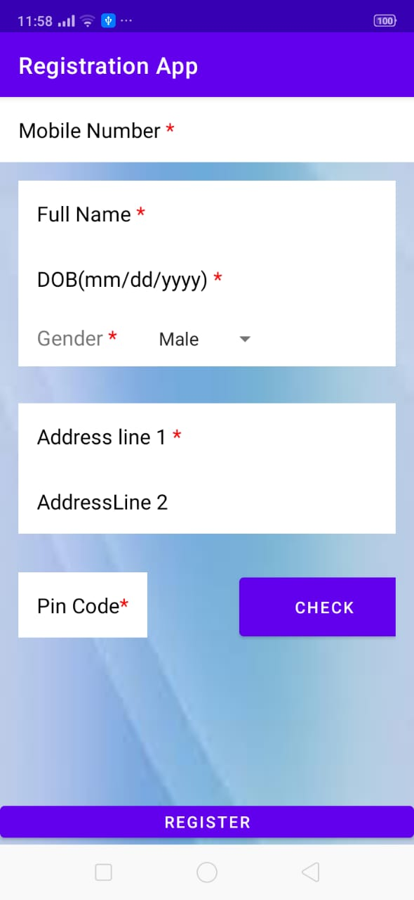
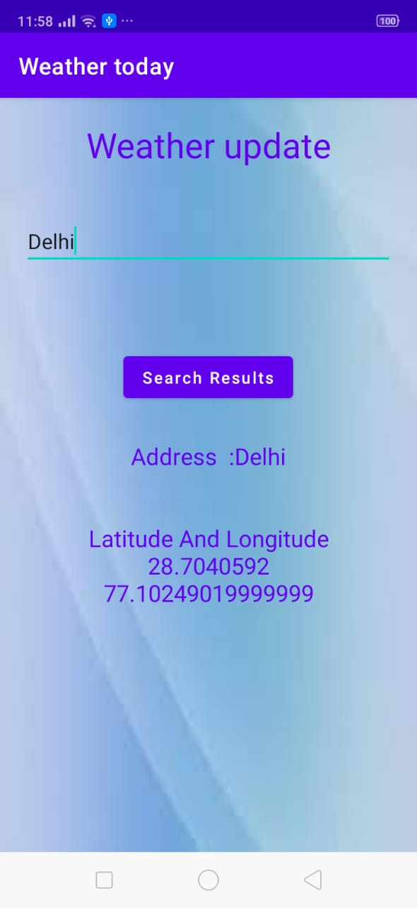

# Registration-And-weather-Info-App
 This is a Android App , in which first register itself by providing details ,then register and then he goes to weather info page where user type city name and get response back.

  Frameworks used :-
  Java Framework, Android SDK
  
  Libraries used :-
  Volley, Built-in intent, Geocoder

 Technologies used :-
  Java ,XML, Android

Screenshots
-----------

#  1. Register Page 

Link of Screeenshot:-https://drive.google.com/file/d/10BNfDTBVciVpUY-mTRw4tuhlbx1ILyPV/view?usp=sharing

#  2.Weather info Page

Link of Screeenshot:-https://drive.google.com/file/d/1i4GsOR91EPxH6I6ouKxi6CQ-pE2tIqjX/view?usp=sharing

#  3.weather Page after Executed

Link of Screeenshot:-https://drive.google.com/file/d/19VlLCNpIpDUVh8QcLr5MVVZFnoU8olyX/view?usp=sharing

